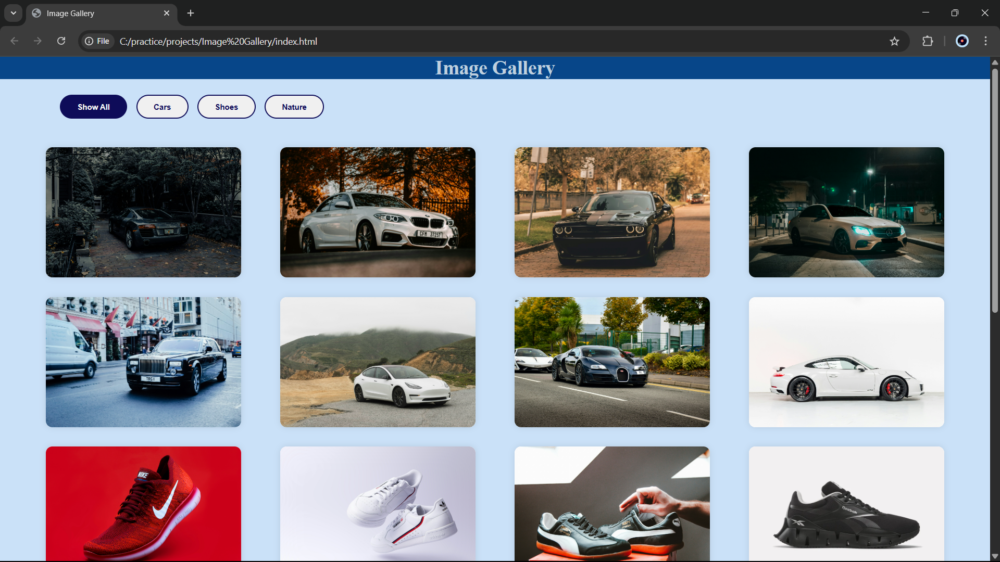

# Filterable Image Gallery

## Overview
This is a simple, filterable image gallery project built using HTML, CSS, and JavaScript. Users can filter images by category using buttons, making it an interactive and visually appealing gallery.

## Features
- Responsive design with a clean and modern UI.
- Categories: Cars, Shoes, Nature.
- Filter functionality to display images based on the selected category.
- "Show All" button to reset the gallery and view all images.

## Technologies Used
- **HTML**: Structure of the webpage.
- **CSS**: Styling and layout design.
- **JavaScript**: Dynamic filtering functionality.

## Installation
1. Clone the repository or download the project files.
   ```sh
   git clone https://github.com/dhruvb2204/image-gallery.git
   ``` 
2. Navigate to the project folder.
   ```sh
   cd image-gallery
   ```
3. Open `index.html` in a web browser.
4. Use the filter buttons to display images by category.
5. Hover over the images to expand and see details regarding the images.

## How to use
- Click on the category buttons to filter images.
- Click on "Show All" to display all images.

## Project Structure
```
image-gallery/
│── index.html    #Main HTML file
│── style.css     #CSS file for styling     
│── script.js     #JavaScript file for interactivity
│── README.md     #Project Documentation
│── images/
│   ├── cars/
│   ├── shoes/
│   ├── nature/
```

## Screenshot



## License
This project is open-source and available under the MIT License.


## Author
- Created by [Dhruv Baldev](https://github.com/dhruvb2204)

